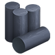
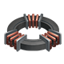
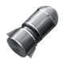

# Dyson Sphere Program Blueprints
保存自己制作的戴森球计划蓝图。

## [Blueprints](Blueprints)
此目录中包含自己制作的戴森球计划蓝图文件。

* 所有使用增产剂的蓝图，除有特别说明，设施均设置为增产模式，且均以增产剂Mk.III计算。
* 对于只有加速模式的设施，除有特别说明，蓝图以不使用增产剂设置。
* 产量、用量层数指传送带上货物的堆叠层数。未标注的为1层。
* `需增产`：指输入的原料应自行喷涂增产剂Mk.III后再接入此蓝图的设施。
* 由于煤矿比原油相对稀缺，未提供重整精炼(2精炼油1氢1煤矿->3精炼油)。

目录：
* [单纯使用熔炉](#单纯使用熔炉)
* [单纯使用制造台](#单纯使用制造台)
* [单纯使用原油精炼厂](#单纯使用原油精炼厂)
* [单纯使用分馏塔](#单纯使用分馏塔)
* [单纯使用化工厂](#单纯使用化工厂)
* [单纯使用粒子对撞机](#单纯使用粒子对撞机)
* [综合使用](#综合使用)
* [建筑工厂](#建筑工厂)
  * [初级工厂](#初级工厂)
  * [建筑工厂](#建筑工厂-1)
  * [黑雾制造工厂](#黑雾制造工厂)
  * [战争工厂](#战争工厂)
* [铺设](#铺设)

## 单纯使用熔炉
<table>
  <tr>
    <th colspan="4">产物</th>
    <th colspan="2">原料</th>
    <th rowspan="2">备注</th>
  </tr>
  <tr>
    <th><a href="Blueprints/使用电弧熔炉">电弧熔炉版</a></th>
    <th><a href="Blueprints/使用位面熔炉">位面熔炉版</a></th>
    <th><a href="Blueprints/使用负熵熔炉">负熵熔炉版</a></th>
    <th>产量</th>
    <th>名称</th>
    <th>用量</th>
  </tr>
  <tr>
    <th><a href="Blueprints/使用电弧熔炉/晶格硅7200.txt?raw=1">晶格硅</a></th>
    <th><a href="Blueprints/使用位面熔炉/晶格硅7200.txt?raw=1">晶格硅</a></th>
    <th><a href="Blueprints/使用负熵熔炉/晶格硅7200.txt?raw=1">晶格硅</a></th>
    <td>7200(4层)</td>
    <td>硅块</td>
    <td>5760(4层)</td>
    <td>需增产。</td>
  </tr>
  <tr>
    <th><a href="Blueprints/使用电弧熔炉/玻璃4500.txt?raw=1">玻璃</a></th>
    <th><a href="Blueprints/使用位面熔炉/玻璃4500.txt?raw=1">玻璃</a></th>
    <th><a href="Blueprints/使用负熵熔炉/玻璃4500.txt?raw=1">玻璃</a></th>
    <td>4500(4层)</td>
    <td>石矿</td>
    <td>7200(4层)</td>
    <td>需增产。</td>
  </tr>
  <tr>
    <th><a href="Blueprints/使用电弧熔炉/石材7200.txt?raw=1">石材</a></th>
    <th><a href="Blueprints/使用位面熔炉/石材7200.txt?raw=1">石材</a></th>
    <th><a href="Blueprints/使用负熵熔炉/石材7200.txt?raw=1">石材</a></th>
    <td>7200(4层)</td>
    <td>石矿</td>
    <td>5760(4层)</td>
    <td>需增产。</td>
  </tr>
  <tr>
    <th><a href="Blueprints/使用电弧熔炉/硅块4500.txt?raw=1">硅块</a></th>
    <th><a href="Blueprints/使用位面熔炉/硅块4500.txt?raw=1">硅块</a></th>
    <th><a href="Blueprints/使用负熵熔炉/硅块4500.txt?raw=1">硅块</a></th>
    <td>4500(4层)</td>
    <td>硅矿</td>
    <td>7200(4层)</td>
    <td>需增产。</td>
  </tr>
  <tr>
    <th><a href="Blueprints/使用电弧熔炉/磁铁7200.txt?raw=1">磁铁</a></th>
    <th><a href="Blueprints/使用位面熔炉/磁铁7200.txt?raw=1">磁铁</a></th>
    <th><a href="Blueprints/使用负熵熔炉/磁铁7200.txt?raw=1">磁铁</a></th>
    <td>7200(4层)</td>
    <td>铁矿</td>
    <td>5760(4层)</td>
    <td>需增产。</td>
  </tr>
  <tr>
    <th><a href="Blueprints/使用电弧熔炉/金刚石7200.txt?raw=1">金刚石</a></th>
    <th><a href="Blueprints/使用位面熔炉/金刚石7200.txt?raw=1">金刚石</a></th>
    <th><a href="Blueprints/使用负熵熔炉/金刚石7200.txt?raw=1">金刚石</a></th>
    <td>7200(4层)</td>
    <td>高能石墨</td>
    <td>7200(4层)</td>
    <td>需增产。</td>
  </tr>
  <tr>
    <th><a href="Blueprints/使用电弧熔炉/金刚石珍奇7200%202层原料.txt?raw=1">金刚石(珍奇)</a></th>
    <th>/</th>
    <th>/</th>
    <td>7200(4层)</td>
    <td>金伯利矿石</td>
    <td>2880(2层)</td>
    <td>需增产。</td>
  </tr>
  <tr>
    <th><a href="Blueprints/使用电弧熔炉/金刚石珍奇7200%204层原料.txt?raw=1">金刚石(珍奇)</a></th>
    <th><a href="Blueprints/使用位面熔炉/金刚石珍奇7200.txt?raw=1">金刚石(珍奇)</a></th>
    <th><a href="Blueprints/使用负熵熔炉/金刚石珍奇7200.txt?raw=1">金刚石(珍奇)</a></th>
    <td>7200(4层)</td>
    <td>金伯利矿石</td>
    <td>2880(4层)</td>
    <td>需增产。</td>
  </tr>
  <tr>
    <th rowspan="3"><a href="Blueprints/使用电弧熔炉/钛合金1800.txt?raw=1">钛合金</a></th>
    <th rowspan="3">/</th>
    <th rowspan="3">/</th>
    <td rowspan="3">1800</td>
    <td>钛块</td>
    <td>1440</td>
    <td rowspan="3">需增产。</td>
  </tr>
  <tr>
    <td>钢材</td>
    <td>1440</td>
  </tr>
  <tr>
    <td>硫酸</td>
    <td>2880(2层)</td>
  </tr>
  <tr>
    <th rowspan="3">/</th>
    <th rowspan="3"><a href="Blueprints/使用位面熔炉/钛合金1800.txt?raw=1">钛合金</a></th>
    <th rowspan="3"><a href="Blueprints/使用负熵熔炉/钛合金1800.txt?raw=1">钛合金</a></th>
    <td rowspan="3">1800</td>
    <td>钛块</td>
    <td>1440(4层)</td>
    <td rowspan="3">需增产。 输入均为4层。</td>
  </tr>
  <tr>
    <td>钢材</td>
    <td>1440(4层)</td>
  </tr>
  <tr>
    <td>硫酸</td>
    <td>2880(4层)</td>
  </tr>
  <tr>
    <th><a href="Blueprints/使用电弧熔炉/钛块4500.txt?raw=1">钛块</a></th>
    <th><a href="Blueprints/使用位面熔炉/钛块4500.txt?raw=1">钛块</a></th>
    <th><a href="Blueprints/使用负熵熔炉/钛块4500.txt?raw=1">钛块</a></th>
    <td>4500(4层)</td>
    <td>钛矿</td>
    <td>7200(4层)</td>
    <td>需增产。</td>
  </tr>
  <tr>
    <th><a href="Blueprints/使用电弧熔炉/钢材3000.txt?raw=1">钢材</a></th>
    <th><a href="Blueprints/使用位面熔炉/钢材3000.txt?raw=1">钢材</a></th>
    <th><a href="Blueprints/使用负熵熔炉/钢材3000.txt?raw=1">钢材</a></th>
    <td>3000(2层)</td>
    <td>铁块</td>
    <td>7200(4层)</td>
    <td>需增产。</td>
  </tr>
  <tr>
    <th><a href="Blueprints/使用电弧熔炉/铁块7200.txt?raw=1">铁块</a></th>
    <th><a href="Blueprints/使用位面熔炉/铁块7200.txt?raw=1">铁块</a></th>
    <th><a href="Blueprints/使用负熵熔炉/铁块7200.txt?raw=1">铁块</a></th>
    <td>7200(4层)</td>
    <td>铁矿</td>
    <td>5760(4层)</td>
    <td>需增产。</td>
  </tr>
  <tr>
    <th><a href="Blueprints/使用电弧熔炉/铜块7200.txt?raw=1">铜块</a></th>
    <th><a href="Blueprints/使用位面熔炉/铜块7200.txt?raw=1">铜块</a></th>
    <th><a href="Blueprints/使用负熵熔炉/铜块7200.txt?raw=1">铜块</a></th>
    <td>7200(4层)</td>
    <td>铜矿</td>
    <td>5760(4层)</td>
    <td>需增产。</td>
  </tr>
  <tr>
    <th><a href="Blueprints/使用电弧熔炉/高能石墨360%20无增产.txt?raw=1">高能石墨</a></th>
    <th>/</th>
    <th>/</th>
    <td>360</td>
    <td>煤矿</td>
    <td>720</td>
    <td>无增产。</td>
  </tr>
  <tr>
    <th><a href="Blueprints/使用电弧熔炉/高能石墨4500.txt?raw=1">高能石墨</a></th>
    <th><a href="Blueprints/使用位面熔炉/高能石墨4500.txt?raw=1">高能石墨</a></th>
    <th><a href="Blueprints/使用负熵熔炉/高能石墨4500.txt?raw=1">高能石墨</a></th>
    <td>4500(4层)</td>
    <td>煤矿</td>
    <td>7200(4层)</td>
    <td>需增产。</td>
  </tr>
</table>

## 单纯使用制造台
<table>
  <tr>
    <th colspan="3">产物</th>
    <th colspan="2">原料</th>
    <th rowspan="2">备注</th>
  </tr>
  <tr>
    <th><a href="Blueprints/使用制造台Mk.I">制造台 Mk.I版</a></th>
    <th><a href="Blueprints/使用制造台Mk.II">制造台 Mk.II版</a></th>
    <th>产量</th>
    <th>名称</th>
    <th>用量</th>
  </tr>
  <tr>
    <th rowspan="2">/</th>
    <th rowspan="2"><a href="Blueprints/使用制造台Mk.II/光子合并器600%20无增产.txt?raw=1">光子合并器</a></th>
    <td rowspan="2">600</td>
    <td>棱镜</td>
    <td>1200</td>
    <td rowspan="2">无增产。</td>
  </tr>
  <tr>
    <td>电路板</td>
    <td>600</td>
  </tr>
   <tr>
    <th rowspan="3">/</th>
    <th rowspan="3"><a href="Blueprints/使用制造台Mk.II/卡西米尔晶体300%20无增产.txt?raw=1">卡西米尔晶体</a></th>
    <td rowspan="3">300</td>
    <td>氢</td>
    <td>3600(2层)</td>
    <td rowspan="3">无增产。 其中氢分2路提供， 分别为1800、1800。</td>
  </tr>
  <tr>
    <td>钛晶石</td>
    <td>300</td>
  </tr>
  <tr>
    <td>石墨烯</td>
    <td>600</td>
  </tr>
   <tr>
    <th rowspan="2"><a href="Blueprints/使用制造台Mk.I/地基90%20无增产.txt?raw=1">地基</a></th>
    <th rowspan="2">/</th>
    <td rowspan="2">90</td>
    <td>石材</td>
    <td>270</td>
    <td rowspan="2">无增产。 无配电。</td>
  </tr>
  <tr>
    <td>钢材</td>
    <td>90</td>
  </tr>
  <tr>
    <th rowspan="3">/</th>
    <th rowspan="3"><a href="Blueprints/使用制造台Mk.II/星际物流运输船20%20无增产.txt?raw=1">星际物流运输船</a></th>
    <td rowspan="3">20</td>
    <td>电磁涡轮</td>
    <td>200</td>
    <td rowspan="3">无增产。</td>
  </tr>
  <tr>
    <td>钛合金</td>
    <td>400</td>
  </tr>
  <tr>
    <td>处理器</td>
    <td>200</td>
  </tr>
  <tr>
    <th rowspan="2"><a href="Blueprints/使用制造台Mk.I/液氢燃料棒20%20无增产.txt?raw=1">液氢燃料棒</a></th>
    <th rowspan="2">/</td>
    <td rowspan="2">20</td>
    <td>钛块</td>
    <td>20</td>
    <td rowspan="2">无增产。 无配电。</td>
  </tr>
  <tr>
    <td>氢</td>
    <td>100</td>
  </tr>
  <tr>
    <th rowspan="4">/</th>
    <th rowspan="4"><a href="Blueprints/使用制造台Mk.II/物流运输船15%20无增产.txt?raw=1">物流运输船</a></th>
    <td rowspan="4">15</td>
    <td>铜块</td>
    <td>90</td>
    <td rowspan="4">无增产。</td>
  </tr>
  <tr>
    <td>钢材</td>
    <td>60</td>
  </tr>
  <tr>
    <td>铁块</td>
    <td>75</td>
  </tr>
  <tr>
    <td>处理器</td>
    <td>30</td>
  </tr>
    <tr>
    <th rowspan="3">/</th>
    <th rowspan="3"><a href="Blueprints/使用制造台Mk.II/电动机720%20无增产.txt?raw=1">电动机</a></th>
    <td rowspan="3">720</td>
    <td>铁块</td>
    <td>1440</td>
    <td rowspan="3">无增产。 使用增产剂时，将出口传送带升级， 产量为900。</td>
  </tr>
  <tr>
    <td>齿轮</td>
    <td>720</td>
  </tr>
  <tr>
    <td>磁线圈</td>
    <td>720</td>
  </tr>
  <tr>
    <th rowspan="2">/</th>
    <th rowspan="2"><a href="Blueprints/使用制造台Mk.II/电磁涡轮360%20无增产.txt?raw=1">电磁涡轮</a></th>
    <td rowspan="2">360</td>
    <td>电动机</td>
    <td>720</td>
    <td rowspan="2">无增产。 使用增产剂时，产量为450。</td>
  </tr>
  <tr>
    <td>磁线圈</td>
    <td>720</td>
  </tr>
  <tr>
    <th rowspan="2"><a href="Blueprints/使用制造台Mk.I/电路板720%20无增产.txt?raw=1">电路板</a></th>
    <th rowspan="2">/</th>
    <td rowspan="2">720</td>
    <td>铜块</td>
    <td>360</td>
    <td rowspan="2">无增产。</td>
  </tr>
  <tr>
    <td>铁块</td>
    <td>720</td>
  </tr>
    <tr>
    <th rowspan="2">/</th>
    <th rowspan="2"><a href="Blueprints/使用制造台Mk.II/电路板1800%20无增产.txt?raw=1">电路板</a></th>
    <td rowspan="2">1800</td>
    <td>铜块</td>
    <td>900</td>
    <td rowspan="2">无增产。</td>
  </tr>
  <tr>
    <td>铁块</td>
    <td>1800</td>
  </tr>
  <tr>
    <th rowspan="2">/</th>
    <th rowspan="2"><a href="Blueprints/使用制造台Mk.II/磁线圈720%20无增产.txt?raw=1">磁线圈</a></th>
    <td rowspan="2">720</td>
    <td>铜块</td>
    <td>360</td>
    <td rowspan="2">无增产。</td>
  </tr>
  <tr>
    <td>磁铁</td>
    <td>720</td>
  </tr>
  <tr>
    <th>/</th>
    <th><a href="Blueprints/使用制造台Mk.II/空间翘曲器360%20无增产.txt?raw=1">空间翘曲器</a></th>
    <td>360</td>
    <td>引力矩阵</td>
    <td>36</td>
    <td>需增产。</td>
  </tr>
  <tr>
    <th rowspan="3">/</th>
    <th rowspan="3"><a href="Blueprints/使用制造台Mk.II/粒子容器360%20无增产.txt?raw=1">粒子容器</a></th>
    <td rowspan="3">360</td>
    <td>电磁涡轮</td>
    <td>720</td>
    <td rowspan="3">无增产。</td>
  </tr>
  <tr>
    <td>铜块</td>
    <td>720</td>
  </tr>
  <tr>
    <td>石墨烯</td>
    <td>720</td>
  </tr>
  <tr>
    <th rowspan="3">/</th>
    <th rowspan="3"><a href="Blueprints/使用制造台Mk.II/粒子宽带360%20无增产.txt?raw=1">粒子宽带</a></th>
    <td rowspan="3">360</td>
    <td>碳纳米管</td>
    <td>720</td>
    <td rowspan="3">无增产。</td>
  </tr>
  <tr>
    <td>晶格硅</td>
    <td>720</td>
  </tr>
  <tr>
    <td>塑料</td>
    <td>360</td>
  </tr>
  <tr>
    <th rowspan="3">/</th>
    <th rowspan="3"><a href="Blueprints/使用制造台Mk.II/钛化玻璃360%20无增产.txt?raw=1">钛化玻璃</a></th>
    <td rowspan="3">360</td>
    <td>玻璃</td>
    <td>720</td>
    <td rowspan="3">无增产。</td>
  </tr>
  <tr>
    <td>钛块</td>
    <td>720</td>
  </tr>
  <tr>
    <td>水</td>
    <td>720</td>
  </tr>
  <tr>
    <th rowspan="2">/</th>
    <th rowspan="2"><a href="Blueprints/使用制造台Mk.II/钛晶石360%20无增产.txt?raw=1">钛晶石</a></th>
    <td rowspan="2">360</td>
    <td>有机晶体</td>
    <td>360</td>
    <td rowspan="2">无增产。</td>
  </tr>
  <tr>
    <td>钛块</td>
    <td>1080</td>
  </tr>
  <tr>
    <th><a href="Blueprints/使用制造台Mk.I/齿轮360%20无增产.txt?raw=1">齿轮</a></th>
    <th><a href="Blueprints/使用制造台Mk.II/齿轮360%20无增产.txt?raw=1">齿轮</a></th>
    <td>360</td>
    <td>铁块</td>
    <td>360</td>
    <td>无增产。</td>
  </tr>
  <tr>
    <th rowspan="2">/</th>
    <th rowspan="2"><a href="Blueprints/使用制造台Mk.II/动力引擎360%20无增产.txt?raw=1">动力引擎</a></th>
    <td rowspan="2">360</td>
    <td>磁线圈</td>
    <td>360</td>
    <td rowspan="2">无增产。</td>
  </tr>
  <tr>
    <td>铜块</td>
    <td>720</td>
  </tr>
  <tr>
    <th>/</th>
    <th><a href="Blueprints/使用制造台Mk.II/燃烧单元360%20无增产.txt?raw=1">燃烧单元</a></th>
    <td>360</td>
    <td>煤矿</td>
    <td>1080</td>
    <td>无增产。</td>
  </tr>
  <tr>
    <th><a href="Blueprints/使用制造台Mk.I/机枪弹箱90%20无增产.txt?raw=1">机枪弹箱</a></th>
    <th>/</th>
    <td>90</td>
    <td>铜块</td>
    <td>360</td>
    <td>无增产。无配电。</td>
  </tr>
  <tr>
    <th rowspan="4">/</th>
    <th rowspan="4"><a href="Blueprints/使用制造台Mk.II/导弹组180%20无增产.txt?raw=1">导弹组</a></th>
    <td rowspan="4">180</td>
    <td>铜块</td>
    <td>1080</td>
    <td rowspan="4">无增产。</td>
  </tr>
  <tr>
    <td>电路板</td>
    <td>540</td>
  </tr>
  <tr>
    <td>燃烧单元</td>
    <td>360</td>
  </tr>
  <tr>
    <td>动力引擎</td>
    <td>180</td>
  </tr>
  <tr>
    <th rowspan="2">/</th>
    <th rowspan="2"><a href="Blueprints/使用制造台Mk.II/炮弹组160%20无增产.txt?raw=1">炮弹组</a></th>
    <td rowspan="2">160</td>
    <td>铜块</td>
    <td>1440</td>
    <td rowspan="2">无增产。无配电。 其中铜块分3路提供， 分别为720、720。</td>
  </tr>
  <tr>
    <td>燃烧单元</td>
    <td>320</td>
  </tr>
  <tr>
    <th rowspan="3">/</th>
    <th rowspan="3"><a href="Blueprints/使用制造台Mk.II/等离子胶囊180%20无增产.txt?raw=1">等离子胶囊</a></th>
    <td rowspan="3">180</td>
    <td>石墨烯</td>
    <td>180</td>
    <td rowspan="3">无增产。</td>
  </tr>
  <tr>
    <td>磁铁</td>
    <td>360</td>
  </tr>
  <tr>
    <td>重氢</td>
    <td>1800</td>
  </tr>
</table>

<table>
  <tr>
    <th colspan="3">产物</th>
    <th colspan="2">原料</th>
    <th rowspan="2">备注</th>
  </tr>
  <tr>
    <th><a href="Blueprints/使用制造台Mk.III">制造台 Mk.III版</a></th>
    <th><a href="Blueprints/使用重组式制造台">重组式 制造台版</a></th>
    <th>产量</th>
    <th>名称</th>
    <th>用量</th>
  </tr>
  <tr>
    <th rowspan="2"><a href="Blueprints/使用制造台Mk.III/光子合并器1800.txt?raw=1">光子合并器</a></th>
    <th rowspan="2"><a href="Blueprints/使用重组式制造台/光子合并器1800.txt?raw=1">光子合并器</a></th>
    <td rowspan="2">1800</td>
    <td>棱镜</td>
    <td>2880(4层)</td>
    <td rowspan="2">需增产。</td>
  </tr>
  <tr>
    <td>电路板</td>
    <td>1440(4层)</td>
  </tr>
  <tr>
    <th rowspan="2"><a href="Blueprints/使用制造台Mk.III/光子合并器珍奇1800.txt?raw=1">光子合并器 (珍奇)</a></th>
    <th rowspan="2"><a href="Blueprints/使用重组式制造台/光子合并器珍奇1800.txt?raw=1">光子合并器 (珍奇)</a></th>
    <td rowspan="2">1800</td>
    <td>光栅石</td>
    <td>1440(4层)</td>
    <td rowspan="2">需增产。</td>
  </tr>
  <tr>
    <td>电路板</td>
    <td>1440(4层)</td>
  </tr>
  <tr>
    <th rowspan="3"><a href="Blueprints/使用制造台Mk.III/卡西米尔晶体1800.txt?raw=1">卡西米尔 晶体</a></th>
    <th rowspan="3"><a href="Blueprints/使用重组式制造台/卡西米尔晶体1800.txt?raw=1">卡西米尔 晶体</a></th>
    <td rowspan="3">1800</td>
    <td>氢</td>
    <td>17280(4层)</td>
    <td rowspan="3">需增产。 其中氢分3路提供， 分别为6480、4320、6480。</td>
  </tr>
  <tr>
    <td>钛晶石</td>
    <td>1440</td>
  </tr>
  <tr>
    <td>石墨烯</td>
    <td>2880(2层)</td>
  </tr>
  <tr>
    <th rowspan="3"><a href="Blueprints/使用制造台Mk.III/卡西米尔晶体珍奇1800.txt?raw=1">卡西米尔 晶体(珍奇)</a></th>
    <th rowspan="3"><a href="Blueprints/使用重组式制造台/卡西米尔晶体珍奇1800.txt?raw=1">卡西米尔 晶体(珍奇)</a></th>
    <td rowspan="3">1800</td>
    <td>氢</td>
    <td>17280(4层)</td>
    <td rowspan="3">需增产。 其中氢分3路提供， 分别为6480、4320、6480； 光栅石分2路提供， 分别为5760、5760。</td>
  </tr>
  <tr>
    <td>光栅石</td>
    <td>11520(4层)</td>
  </tr>
  <tr>
    <td>石墨烯</td>
    <td>2880(4层)</td>
  </tr>
  <tr>
    <th rowspan="2"><a href="Blueprints/使用制造台Mk.III/处理器1800.txt?raw=1">处理器</a></th>
    <th rowspan="2"><a href="Blueprints/使用重组式制造台/处理器1800.txt?raw=1">处理器</a></th>
    <td rowspan="2">1800</td>
    <td>电路板</td>
    <td>2880(2/4层)</td>
    <td rowspan="2">需增产。 重组式制造台需要4层原料。</td>
  </tr>
  <tr>
    <td>微晶元件</td>
    <td>2880(2/4层)</td>
  </tr>
  <tr>
    <th rowspan="2"><a href="Blueprints/使用制造台Mk.III/太阳帆3600.txt?raw=1">太阳帆</a></th>
    <th rowspan="2"><a href="Blueprints/使用重组式制造台/太阳帆3600.txt?raw=1">处理器</a></th>
    <td rowspan="2">3600(2层)</td>
    <td>石墨烯</td>
    <td>1440(1/4层)</td>
    <td rowspan="2">需增产。 重组式制造台需要4层原料。</td>
  </tr>
  <tr>
    <td>光子合并器</td>
    <td>1440(1/4层)</td>
  </tr>
  <tr>
    <th rowspan="2"><a href="Blueprints/使用制造台Mk.III/引力透镜900.txt?raw=1">引力透镜</a></th>
    <th rowspan="2">/</th>
    <td rowspan="2">900</td>
    <td>金刚石</td>
    <td>2880(2层)</td>
    <td rowspan="2">需增产。</td>
  </tr>
  <tr>
    <td>奇异物质</td>
    <td>720</td>
  </tr>
  <tr>
    <th rowspan="2">/</th>
    <th rowspan="2"><a href="Blueprints/使用重组式制造台/引力透镜1800.txt?raw=1">引力透镜</a></th>
    <td rowspan="2">1800</td>
    <td>金刚石</td>
    <td>5760(4层)</td>
    <td rowspan="2">需增产。</td>
  </tr>
  <tr>
    <td>奇异物质</td>
    <td>1440(4层)</td>
  </tr>
  <tr>
    <th rowspan="2"><a href="Blueprints/使用制造台Mk.III/微晶元件4500.txt?raw=1">微晶元件</a></th>
    <th rowspan="2">/</th>
    <td rowspan="2">4500 (2/4层混合)</td>
    <td>硅块</td>
    <td>7200(4层)</td>
    <td rowspan="2">需增产。</td>
  </tr>
  <tr>
    <td>铜块</td>
    <td>3600(2层)</td>
  </tr>
  <tr>
    <th rowspan="2">/</th>
    <th rowspan="2"><a href="Blueprints/使用重组式制造台/微晶元件7200.txt?raw=1">微晶元件</a></th>
    <td rowspan="2">7200(4层)</td>
    <td>硅块</td>
    <td>11520(4层)</td>
    <td rowspan="2">需增产。 其中硅块分2路提供， 分别为7200、4320。</td>
  </tr>
  <tr>
    <td>铜块</td>
    <td>5760(4层)</td>
  </tr>
  <tr>
    <th rowspan="4"><a href="Blueprints/使用制造台Mk.III/星际物流运输船15.txt?raw=1">星际物流运输船</a></th>
    <th rowspan="4">/</th>
    <td rowspan="4">15</td>
    <td>电磁涡轮</td>
    <td>120(需增产)</td>
    <td rowspan="4">部分原料需增产。</td>
  </tr>
  <tr>
    <td>钛合金</td>
    <td>120(需增产)</td>
  </tr>
  <tr>
    <td>钛合金</td>
    <td>150</td>
  </tr>
  <tr>
    <td>处理器</td>
    <td>150</td>
  </tr>
  <tr>
    <th><a href="Blueprints/使用制造台Mk.III/晶格硅珍奇7200.txt?raw=1">晶格硅(珍奇)</a></th>
    <th><a href="Blueprints/使用重组式制造台/晶格硅珍奇7200.txt?raw=1">晶格硅(珍奇)</a></th>
    <td>7200(4层)</td>
    <td>分形硅石</td>
    <td>2880(2/4层)</td>
    <td>需增产。 重组式制造台需要4层原料。</td>
  </tr>
  <tr>
    <th><a href="Blueprints/使用制造台Mk.III/棱镜6000.txt?raw=1">棱镜</a></th>
    <th>/</th>
    <td>6000(4层)</td>
    <td>玻璃</td>
    <td>7200(4层)</td>
    <td>需增产。</td>
  </tr>
  <tr>
    <th>/</th>
    <th><a href="Blueprints/使用重组式制造台/棱镜7200.txt?raw=1">棱镜</a></th>
    <td>7200(4层)</td>
    <td>玻璃</td>
    <td>8640(4层)</td>
    <td>需增产。 其中玻璃分2路提供， 分别为6480、2160。</td>
  </tr>
  <tr>
    <th rowspan="6"><a href="Blueprints/使用制造台Mk.III/氘核燃料棒900.txt?raw=1">氘核燃料棒</a></th>
    <th rowspan="6">/</th>
    <td rowspan="6">900</td>
    <td>钛合金</td>
    <td>360</td>
    <td rowspan="6">需增产。 输入增产剂用于中间产物喷涂。</td>
  </tr>
  <tr>
    <td>重氢</td>
    <td>7200(4层)</td>
  </tr>
  <tr>
    <td>磁线圈</td>
    <td>864</td>
  </tr>
  <tr>
    <td>电磁涡轮</td>
    <td>576</td>
  </tr>
  <tr>
    <td>高能石墨</td>
    <td>288</td>
  </tr>
  <tr>
    <td>增产剂Mk.III</td>
    <td>少量</td>
  </tr>
  <tr>
    <th rowspan="4"><a href="Blueprints/使用制造台Mk.III/物流运输船23.txt?raw=1">物流运输船</a></th>
    <th rowspan="4">/</th>
    <td rowspan="4">23</td>
    <td>铜块</td>
    <td>108(需增产)</td>
    <td rowspan="4">部分原料需增产。</td>
  </tr>
  <tr>
    <td>钢材</td>
    <td>72(需增产)</td>
  </tr>
  <tr>
    <td>铁块</td>
    <td>112.5</td>
  </tr>
  <tr>
    <td>处理器</td>
    <td>45</td>
  </tr>
  <tr>
    <th rowspan="3"><a href="Blueprints/使用制造台Mk.III/电动机1800.txt?raw=1">电动机</a></th>
    <th rowspan="3">/</th>
    <td rowspan="3">1800</td>
    <td>铁块</td>
    <td>2880(2层)</td>
    <td rowspan="3">需增产。</td>
  </tr>
  <tr>
    <td>齿轮</td>
    <td>1440</td>
  </tr>
  <tr>
    <td>磁线圈</td>
    <td>1440</td>
  </tr>
  <tr>
    <th rowspan="3">/</th>
    <th rowspan="3"><a href="Blueprints/使用重组式制造台/电动机7200.txt?raw=1">电动机</a></th>
    <td rowspan="3">7200(4层)</td>
    <td>铁块</td>
    <td>11520(4层)</td>
    <td rowspan="3">需增产。 其中铁块分2路提供， 分别为6120、5400。</td>
  </tr>
  <tr>
    <td>齿轮</td>
    <td>5760</td>
  </tr>
  <tr>
    <td>磁线圈</td>
    <td>5760</td>
  </tr>
  <tr>
    <th rowspan="2"><a href="Blueprints/使用制造台Mk.III/电磁涡轮1800.txt?raw=1">电磁涡轮</a></th>
    <th rowspan="2">/</th>
    <td rowspan="2">1800</td>
    <td>电动机</td>
    <td>2880(2层)</td>
    <td rowspan="2">需增产。</td>
  </tr>
  <tr>
    <td>磁线圈</td>
    <td>2880(2层)</td>
  </tr>
  <tr>
    <th rowspan="2">/</th>
    <th rowspan="2"><a href="Blueprints/使用重组式制造台/电磁涡轮4500.txt?raw=1">电磁涡轮</a></th>
    <td rowspan="2">4500 (1/4层混合)</td>
    <td>电动机</td>
    <td>7200(4层)</td>
    <td rowspan="2">需增产。</td>
  </tr>
  <tr>
    <td>磁线圈</td>
    <td>7200(4层)</td>
  </tr>
  <tr>
    <th rowspan="2"><a href="Blueprints/使用制造台Mk.III/电路板7200.txt?raw=1">电路板</a></th>
    <th rowspan="2"><a href="Blueprints/使用重组式制造台/电路板7200.txt?raw=1">电路板</a></th>
    <td rowspan="2">7200(4层)</td>
    <td>铜块</td>
    <td>2880(2/4层)</td>
    <td rowspan="2">需增产。 重组式制造台需要4层原料。 重组式制造台需要分拣器货物叠加1级。</td>
  </tr>
  <tr>
    <td>铁块</td>
    <td>5760(4层)</td>
  </tr>
  <tr>
    <th rowspan="2"><a href="Blueprints/使用制造台Mk.III/磁线圈7200.txt?raw=1">磁线圈</a></th>
    <th rowspan="2"><a href="Blueprints/使用重组式制造台/磁线圈7200.txt?raw=1">磁线圈</a></th>
    <td rowspan="2">7200(4层)</td>
    <td>铜块</td>
    <td>2880(2/4层)</td>
    <td rowspan="2">需增产。 重组式制造台需要4层原料。 重组式制造台需要分拣器货物叠加1级。</td>
  </tr>
  <tr>
    <td>磁铁</td>
    <td>5760(4层)</td>
  </tr>
  <tr>
    <th rowspan="3"><a href="Blueprints/使用制造台Mk.III/粒子容器1800.txt?raw=1">粒子容器</a></th>
    <th rowspan="3"><a href="Blueprints/使用重组式制造台/粒子容器1800.txt?raw=1">粒子容器</a></th>
    <td rowspan="3">1800</td>
    <td>电磁涡轮</td>
    <td>2880(2/4层)</td>
    <td rowspan="3">需增产。 重组式制造台需要4层原料。</td>
  </tr>
  <tr>
    <td>铜块</td>
    <td>2880(2/4层)</td>
  </tr>
  <tr>
    <td>石墨烯</td>
    <td>2880(2/4层)</td>
  </tr>
  <tr>
    <th rowspan="2"><a href="Blueprints/使用制造台Mk.III/粒子容器珍奇1800.txt?raw=1">粒子容器 (珍奇)</a></th>
    <th rowspan="2"><a href="Blueprints/使用重组式制造台/粒子容器珍奇1800.txt?raw=1">粒子容器 (珍奇)</a></th>
    <td rowspan="2">1800</td>
    <td>单级磁石</td>
    <td>14400(4层)</td>
    <td rowspan="2">需增产。 其中单级磁石分2路提供， 分别为7200、7200。 重组式制造台需要4层原料。</td>
  </tr>
  <tr>
    <td>铜块</td>
    <td>2880(2/4层)</td>
  </tr>
  <tr>
    <th rowspan="3"><a href="Blueprints/使用制造台Mk.III/粒子宽带900.txt?raw=1">粒子宽带</a></th>
    <th rowspan="3"><a href="Blueprints/使用重组式制造台/粒子宽带900.txt?raw=1">粒子宽带</a></th>
    <td rowspan="3">900</td>
    <td>碳纳米管</td>
    <td>1440(1/4层)</td>
    <td rowspan="3">需增产。 重组式制造台需要2/4层原料。</td>
  </tr>
  <tr>
    <td>晶格硅</td>
    <td>1440(1/4层)</td>
  </tr>
  <tr>
    <td>塑料</td>
    <td>720(1/2层)</td>
  </tr>
  <tr>
    <th rowspan="3"><a href="Blueprints/使用制造台Mk.III/钛化玻璃1800.txt?raw=1">钛化玻璃</a></th>
    <th rowspan="3">/</th>
    <td rowspan="3">1800</td>
    <td>玻璃</td>
    <td>1440</td>
    <td rowspan="3">需增产。</td>
  </tr>
  <tr>
    <td>钛块</td>
    <td>1440</td>
  </tr>
  <tr>
    <td>水</td>
    <td>1440</td>
  </tr>
  <tr>
    <th rowspan="3">/</th>
    <th rowspan="3"><a href="Blueprints/使用重组式制造台/钛化玻璃7200.txt?raw=1">钛化玻璃</a></th>
    <td rowspan="3">7200(4层)</td>
    <td>玻璃</td>
    <td>5760(4层)</td>
    <td rowspan="3">需增产。</td>
  </tr>
  <tr>
    <td>钛块</td>
    <td>5760(4层)</td>
  </tr>
  <tr>
    <td>水</td>
    <td>5760(4层)</td>
  </tr>
  <tr>
    <th rowspan="2"><a href="Blueprints/使用制造台Mk.III/钛晶石1800.txt?raw=1">钛晶石</a></th>
    <th rowspan="2"><a href="Blueprints/使用重组式制造台/钛晶石1800.txt?raw=1">钛晶石</a></th>
    <td rowspan="2">1800</td>
    <td>有机晶体</td>
    <td>1440(1/4层)</td>
    <td rowspan="2">需增产。 重组式制造台需要4层原料。</td>
  </tr>
  <tr>
    <td>钛块</td>
    <td>4320(4层)</td>
  </tr>
  <tr>
    <th><a href="Blueprints/使用制造台Mk.III/齿轮7200.txt?raw=1">齿轮</a></th>
    <th><a href="Blueprints/使用重组式制造台/齿轮7200.txt?raw=1">齿轮</a></th>
    <td>7200(4层)</td>
    <td>铁块</td>
    <td>5760(4层)</td>
    <td>需增产。</td>
  </tr>
  <tr>
    <th rowspan="2"><a href="Blueprints/使用制造台Mk.III/动力引擎1800.txt?raw=1">动力引擎</a></th>
    <th rowspan="2">/</th>
    <td rowspan="2">1800</td>
    <td>磁线圈</td>
    <td>1440(4层)</td>
    <td rowspan="2">需增产。</td>
  </tr>
  <tr>
    <td>铜块</td>
    <td>2880(4层)</td>
  </tr>
  <tr>
    <th rowspan="2">/</th>
    <th rowspan="2"><a href="Blueprints/使用重组式制造台/动力引擎3600.txt?raw=1">动力引擎</a></th>
    <td rowspan="2">3600(2层)</td>
    <td>磁线圈</td>
    <td>2880(4层)</td>
    <td rowspan="2">需增产。</td>
  </tr>
  <tr>
    <td>铜块</td>
    <td>5760(4层)</td>
  </tr>
  <tr>
    <th><a href="Blueprints/使用制造台Mk.III/燃烧单元1800.txt?raw=1">燃烧单元</a></th>
    <th><a href="Blueprints/使用重组式制造台/燃烧单元1800.txt?raw=1">燃烧单元</a></th>
    <td>1800</td>
    <td>煤矿</td>
    <td>4320(4层)</td>
    <td>需增产。</td>
  </tr>
  <tr>
    <th><a href="Blueprints/使用制造台Mk.III/机枪弹箱1800.txt?raw=1">机枪弹箱</a></th>
    <th><a href="Blueprints/使用重组式制造台/机枪弹箱1800.txt?raw=1">机枪弹箱</a></th>
    <td>1800</td>
    <td>铜块</td>
    <td>7200(4层)</td>
    <td>需增产。</td>
  </tr>
  <tr>
    <th rowspan="2"><a href="Blueprints/使用制造台Mk.III/钛化弹箱1800.txt?raw=1">钛化弹箱</a></th>
    <th rowspan="2"><a href="Blueprints/使用重组式制造台/钛化弹箱1800.txt?raw=1">钛化弹箱</a></th>
    <td rowspan="2">1800</td>
    <td>机枪弹箱</td>
    <td>1440(2/4层)</td>
    <td rowspan="2">需增产。 重组式制造台需要4层原料。</td>
  </tr>
  <tr>
    <td>钛块</td>
    <td>2880(2/4层)</td>
  </tr>
  <tr>
    <th rowspan="2"><a href="Blueprints/使用制造台Mk.III/超合金弹箱1800.txt?raw=1">超合金弹箱</a></th>
    <th rowspan="2"><a href="Blueprints/使用重组式制造台/超合金弹箱1800.txt?raw=1">超合金弹箱</a></th>
    <td rowspan="2">1800</td>
    <td>钛化弹箱</td>
    <td>1440(2/4层)</td>
    <td rowspan="2">需增产。 重组式制造台需要4层原料。</td>
  </tr>
  <tr>
    <td>钛合金</td>
    <td>2880(2/4层)</td>
  </tr>
  <tr>
    <th rowspan="4"><a href="Blueprints/使用制造台Mk.III/导弹组1800.txt?raw=1">导弹组</a></th>
    <th rowspan="4"><a href="Blueprints/使用重组式制造台/导弹组1800.txt?raw=1">导弹组</a></th>
    <td rowspan="4">1800</td>
    <td>铜块</td>
    <td>8640(4层)</td>
    <td rowspan="4">需增产。 其中铜块分2路提供， 分别为4320、4320。</td>
  </tr>
  <tr>
    <td>电路板</td>
    <td>4320(4层)</td>
  </tr>
  <tr>
    <td>燃烧单元</td>
    <td>2880(4层)</td>
  </tr>
  <tr>
    <td>动力引擎</td>
    <td>1440(4层)</td>
  </tr>
  <tr>
    <th rowspan="6"><a href="Blueprints/使用制造台Mk.III/超音速导弹组1800.txt?raw=1">超音速导弹组</a></th>
    <th rowspan="6"><a href="Blueprints/使用重组式制造台/超音速导弹组1800.txt?raw=1">超音速导弹组</a></th>
    <td rowspan="6">1800</td>
    <td>导弹组</td>
    <td>1440(4层)</td>
    <td rowspan="6">需增产。 使用制造台Mk.II2个。 输入增产剂用于中间产物喷涂。</td>
  </tr>
  <tr>
    <td>处理器</td>
    <td>2880(4层)</td>
  </tr>
  <tr>
    <td>爆破单元</td>
    <td>2880(4层)</td>
  </tr>
  <tr>
    <td>钢材</td>
    <td>2304(4层)</td>
  </tr>
  <tr>
    <td>铝块</td>
    <td>3456(4层)</td>
  </tr>
  <tr>
    <td>增产剂Mk.III</td>
    <td>少量</td>
  </tr>
  <tr>
    <th rowspan="3"><a href="Blueprints/使用制造台Mk.III/引力导弹组1800.txt?raw=1">引力导弹组</a></th>
    <th rowspan="3"><a href="Blueprints/使用重组式制造台/引力导弹组1800.txt?raw=1">引力导弹组</a></th>
    <td rowspan="3">1800</td>
    <td>超音速导弹组</td>
    <td>1440(4层)</td>
    <td rowspan="3">需增产。</td>
  </tr>
  <tr>
    <td>晶石爆破单元</td>
    <td>2880(4层)</td>
  </tr>
  <tr>
    <td>奇异物质</td>
    <td>1440(4层)</td>
  </tr>
  <tr>
    <th rowspan="2"><a href="Blueprints/使用制造台Mk.III/炮弹组1800.txt?raw=1">炮弹组</a></th>
    <th rowspan="2">/</th>
    <td rowspan="2">1800</td>
    <td>铜块</td>
    <td>12960(4层)</td>
    <td rowspan="2">需增产。 其中铜块分2路提供， 分别为6480、6480。</td>
  </tr>
  <tr>
    <td>燃烧单元</td>
    <td>2880(4层)</td>
  </tr>
  <tr>
    <th rowspan="2">/</th>
    <th rowspan="2"><a href="Blueprints/使用重组式制造台/炮弹组3600.txt?raw=1">炮弹组</a></th>
    <td rowspan="2">3600(2层)</td>
    <td>铜块</td>
    <td>25920(4层)</td>
    <td rowspan="2">需增产。 其中铜块分4路提供， 分别为6480、6480、6480、6480。</td>
  </tr>
  <tr>
    <td>燃烧单元</td>
    <td>5760(4层)</td>
  </tr>
  <tr>
    <th rowspan="3"><a href="Blueprints/使用制造台Mk.III/高爆炮弹组1800.txt?raw=1">高爆炮弹组</a></th>
    <th rowspan="3"><a href="Blueprints/使用重组式制造台/高爆炮弹组1800.txt?raw=1">高爆炮弹组</a></th>
    <td rowspan="3">1800</td>
    <td>炮弹组</td>
    <td>1440(4层)</td>
    <td rowspan="3">需增产。 其中钛块分2路提供， 分别为4320、4320。</td>
  </tr>
  <tr>
    <td>钛块</td>
    <td>8640(4层)</td>
  </tr>
  <tr>
    <td>爆破单元</td>
    <td>2880(4层)</td>
  </tr>
  <tr>
    <th rowspan="3"><a href="Blueprints/使用制造台Mk.III/晶石炮弹组900.txt?raw=1">晶石炮弹组</a></th>
    <th rowspan="3">/</th>
    <td rowspan="3">900</td>
    <td>高爆炮弹组</td>
    <td>720(4层)</td>
    <td rowspan="3">需增产。</td>
  </tr>
  <tr>
    <td>钛合金</td>
    <td>2160(4层)</td>
  </tr>
  <tr>
    <td>晶石爆破单元</td>
    <td>1440(4层)</td>
  </tr>
  <tr>
    <th rowspan="3">/</th>
    <th rowspan="3"><a href="Blueprints/使用重组式制造台/晶石炮弹组1800.txt?raw=1">晶石炮弹组</a></th>
    <td rowspan="3">1800</td>
    <td>高爆炮弹组</td>
    <td>1440(4层)</td>
    <td rowspan="3">需增产。</td>
  </tr>
  <tr>
    <td>钛合金</td>
    <td>4320(4层)</td>
  </tr>
  <tr>
    <td>晶石爆破单元</td>
    <td>2880(4层)</td>
  </tr>
  <tr>
    <th rowspan="3"><a href="Blueprints/使用制造台Mk.III/等离子胶囊1800.txt?raw=1">等离子胶囊</a></th>
    <th rowspan="3"><a href="Blueprints/使用重组式制造台/等离子胶囊1800.txt?raw=1">等离子胶囊</a></th>
    <td rowspan="3">1800</td>
    <td>石墨烯</td>
    <td>1440(4层)</td>
    <td rowspan="3">需增产。 其中重氢分2路提供， 分别为7200、7200。</td>
  </tr>
  <tr>
    <td>磁铁</td>
    <td>2880(4层)</td>
  </tr>
  <tr>
    <td>重氢</td>
    <td>14400(4层)</td>
  </tr>
  <tr>
    <th rowspan="4"><a href="Blueprints/使用制造台Mk.III/反物质胶囊900.txt?raw=1">反物质胶囊</a></th>
    <th rowspan="4">/</th>
    <td rowspan="4">900</td>
    <td>等离子胶囊</td>
    <td>720(4层)</td>
    <td rowspan="4">需增产。</td>
  </tr>
  <tr>
    <td>粒子容器</td>
    <td>720(4层)</td>
  </tr>
  <tr>
    <td>氢</td>
    <td>7200(4层)</td>
  </tr>
  <tr>
    <td>反物质</td>
    <td>7200(4层)</td>
  </tr>
  <tr>
    <th rowspan="6"><a href="Blueprints/使用制造台Mk.III/奇异湮灭燃料棒45%20无增产.txt?raw=1">奇异湮灭燃料棒</a></th>
    <th rowspan="6">/</th>
    <td rowspan="6">45</td>
    <td>反物质燃料棒</td>
    <td>360</td>
    <td rowspan="6">生产框架材料的原料需增产。 生产奇异湮灭燃料棒无增产。</td>
  </tr>
  <tr>
    <td>核心素</td>
    <td>45</td>
  </tr>
  <tr>
    <td>奇异物质</td>
    <td>90</td>
  </tr>
  <tr>
    <td>碳纳米管</td>
    <td>144(需增产)</td>
  </tr>
  <tr>
    <td>钛合金</td>
    <td>36(需增产)</td>
  </tr>
  <tr>
    <td>硅块</td>
    <td>36(需增产)</td>
  </tr>
</table>

## 单纯使用[原油精炼厂](Blueprints/使用原油精炼厂)

<table>
  <tr>
    <th rowspan="2">配方</th>
    <th colspan="2">原料</th>
    <th colspan="2">产物</th>
    <th rowspan="2">备注</th>
  </tr>
  <tr>
    <th>名称</th>
    <th>用量</th>
    <th>名称</th>
    <th>产量</th>
  </tr>
  <tr>
    <th><a href="Blueprints/使用原油精炼厂/X射线裂解600%20无增产.txt?raw=1">X射线裂解</a></th>
    <td>精炼油</td>
    <td>600</td>
    <td>高能石墨</td>
    <td>600</td>
    <td>无增产。 启动时需投入少量氢。谨防氢堵塞。</td>
  </tr>
  <tr>
    <th rowspan="2"><a href="Blueprints/使用原油精炼厂/等离子精炼360宽%20无增产.txt?raw=1">等离子精炼</a> 宽版 无增产 
        <a href="Blueprints/使用原油精炼厂/等离子精炼360宽.txt?raw=1">等离子精炼</a> 宽版 需增产 
        <a href="Blueprints/使用原油精炼厂/等离子精炼360窄%20无增产.txt?raw=1">等离子精炼</a> 无增产 
        <a href="Blueprints/使用原油精炼厂/等离子精炼360窄.txt?raw=1">等离子精炼</a> 需增产
    </th>
    <td rowspan="2">原油</td>
    <td rowspan="2">360</td>
    <td>精炼油</td>
    <td>360</td>
    <td rowspan="2">提供增产、无增产版。 宽版：增加设施间距，应对不同纬度要求。</td>
  </tr>
  <tr>
    <td>氢</td>
    <td>180</td>
  </tr>
</table>

## 单纯使用[分馏塔](Blueprints/使用分馏塔)

<table>
  <tr>
    <th colspan="2">产物</th>
    <th colspan="2">原料</th>
    <th rowspan="2">备注</th>
  </tr>
  <tr>
    <th><a href="Blueprints/使用分馏塔">分馏塔</a></th>
    <th>产量</th>
    <th>名称</th>
    <th>用量</th>
  </tr>
  <tr>
    <th><a href="Blueprints/合成/重氢分馏1700.txt?raw=1">重氢</a>(分馏)</th>
    <td>1700</td>
    <td>氢</td>
    <td>1700(4层)</td>
    <td>需增产。 输入必须4层才可以达到设计效率。</td>
  </tr>
  <tr>
    <th><a href="Blueprints/合成/重氢分馏1766%20无增产.txt?raw=1">重氢</a>(分馏)</th>
    <td>1766</td>
    <td>氢</td>
    <td>1766(4层)</td>
    <td>无增产。 输入必须4层才可以达到设计效率。</td>
  </tr>
</table>

## 单纯使用化工厂

<table>
  <tr>
    <th colspan="3">产物</th>
    <th colspan="2">原料</th>
    <th rowspan="2">备注</th>
  </tr>
  <tr>
    <th><a href="Blueprints/使用化工厂">化工厂</a></th>
    <th><a href="Blueprints/使用量子化工厂">量子化工厂</a></th>
    <th>产量</th>
    <th>名称</th>
    <th>用量</th>
  </tr>
  <tr>
    <th rowspan="2"><a href="Blueprints/使用化工厂/塑料600%20无增产.txt?raw=1">塑料</a></th>
    <th rowspan="2">/</th>
    <td rowspan="2">600</td>
    <td>精炼油</td>
    <td>1800</td>
    <td rowspan="2">无增产。</td>
  </tr>
  <tr>
    <td>高能石墨</td>
    <td>600</td>
  </tr>
  <tr>
    <th rowspan="2">/</th>
    <th rowspan="2"><a href="Blueprints/使用量子化工厂/塑料1800.txt?raw=1">塑料</a></th>
    <td rowspan="2">1800</td>
    <td>精炼油</td>
    <td>4320(4层)</td>
    <td rowspan="2">需增产。</td>
  </tr>
  <tr>
    <td>高能石墨</td>
    <td>1440(4层)</td>
  </tr>
  <tr>
    <th rowspan="3"><a href="Blueprints/使用化工厂/有机晶体180%20无增产.txt?raw=1">有机晶体</a></th>
    <th rowspan="3">/</th>
    <td rowspan="3">180</td>
    <td>塑料</td>
    <td>360</td>
    <td rowspan="3">无增产。</td>
  </tr>
  <tr>
    <td>精炼油</td>
    <td>180</td>
  </tr>
  <tr>
    <td>水</td>
    <td>180</td>
  </tr>
  <tr>
    <th rowspan="3">/</th>
    <th rowspan="3"><a href="Blueprints/使用量子化工厂/有机晶体450%20无增产.txt?raw=1">有机晶体</a></th>
    <td rowspan="3">450</td>
    <td>塑料</td>
    <td>720</td>
    <td rowspan="3">需增产。</td>
  </tr>
  <tr>
    <td>精炼油</td>
    <td>360</td>
  </tr>
  <tr>
    <td>水</td>
    <td>360</td>
  </tr>
  <tr>
    <th rowspan="2"><a href="Blueprints/使用化工厂/石墨烯240%20无增产.txt?raw=1">石墨烯</a></th>
    <th rowspan="2">/</th>
    <td rowspan="2">240</td>
    <td>硫酸</td>
    <td>120</td>
    <td rowspan="2">无增产。</td>
  </tr>
  <tr>
    <td>高能石墨</td>
    <td>360</td>
  </tr>
  <tr>
    <th rowspan="2"><a href="Blueprints/使用化工厂/石墨烯360%20无增产.txt?raw=1">石墨烯</a></th>
    <th rowspan="2">/</th>
    <td rowspan="2">360</td>
    <td>硫酸</td>
    <td>180</td>
    <td rowspan="2">无增产。</td>
  </tr>
  <tr>
    <td>高能石墨</td>
    <td>540</td>
  </tr>
  <tr>
    <th rowspan="3"><a href="Blueprints/使用化工厂/硫酸120%20无增产.txt?raw=1">硫酸</a></th>
    <th rowspan="3">/</th>
    <td rowspan="3">120</td>
    <td>精炼油</td>
    <td>180</td>
    <td rowspan="3">无增产。</td>
  </tr>
  <tr>
    <td>石矿</td>
    <td>240</td>
  </tr>
  <tr>
    <td>水</td>
    <td>120</td>
  </tr>
  <tr>
    <th rowspan="3"><a href="Blueprints/使用化工厂/硫酸360%20无增产.txt?raw=1">硫酸</a></th>
    <th rowspan="3">/</th>
    <td rowspan="3">360</td>
    <td>精炼油</td>
    <td>540</td>
    <td rowspan="3">无增产。</td>
  </tr>
  <tr>
    <td>石矿</td>
    <td>720</td>
  </tr>
  <tr>
    <td>水</td>
    <td>360</td>
  </tr>
  <tr>
    <th rowspan="2"><a href="Blueprints/使用化工厂/碳纳米管720%20无增产.txt?raw=1">碳纳米管</a></th>
    <th rowspan="2">/</th>
    <td rowspan="2">720</td>
    <td>石墨烯</td>
    <td>1080</td>
    <td rowspan="2">无增产。</td>
  </tr>
  <tr>
    <td>钛块</td>
    <td>360</td>
  </tr>
  <tr>
    <th rowspan="2">/</th>
    <th rowspan="2"><a href="Blueprints/使用量子化工厂/碳纳米管1800.txt?raw=1">碳纳米管</a></th>
    <td rowspan="2">1800</td>
    <td>石墨烯</td>
    <td>2160(2层)</td>
    <td rowspan="2">需增产。</td>
  </tr>
  <tr>
    <td>钛块</td>
    <td>720</td>
  </tr>
  <tr>
    <th rowspan="2">/</th>
    <th rowspan="2"><a href="Blueprints/使用量子化工厂/碳纳米管1800.txt?raw=1">碳纳米管</a></th>
    <td rowspan="2">1800</td>
    <td>石墨烯</td>
    <td>2160(2层)</td>
    <td rowspan="2">需增产。</td>
  </tr>
  <tr>
    <td>钛块</td>
    <td>720</td>
  </tr>
  <tr>
    <th>/</th>
    <th><a href="Blueprints/使用量子化工厂/碳纳米管珍奇1800.txt?raw=1">碳纳米管 (珍奇)</a></th>
    <td>1800</td>
    <td>刺笋结晶</td>
    <td>4320(4层)</td>
    <td>需增产。 需要分拣器货物叠加1级。</td>
  </tr>
  <tr>
    <th rowspan="3"><a href="Blueprints/使用化工厂/爆破单元360%20无增产.txt?raw=1">爆破单元</a></th>
    <th rowspan="3">/</th>
    <td rowspan="3">360</td>
    <td>燃烧单元</td>
    <td>360</td>
    <td rowspan="3">无增产。</td>
  </tr>
  <tr>
    <td>塑料</td>
    <td>360</td>
  </tr>
  <tr>
    <td>硫酸</td>
    <td>180</td>
  </tr>
  <tr>
    <th rowspan="3">/</th>
    <th rowspan="3"><a href="Blueprints/使用量子化工厂/爆破单元1800.txt?raw=1">爆破单元</a></th>
    <td rowspan="3">1800</td>
    <td>燃烧单元</td>
    <td>1440</td>
    <td rowspan="3">需增产。</td>
  </tr>
  <tr>
    <td>塑料</td>
    <td>1440</td>
  </tr>
  <tr>
    <td>硫酸</td>
    <td>720</td>
  </tr>
  <tr>
    <th rowspan="3"><a href="Blueprints/使用化工厂/晶石爆破单元360%20无增产.txt?raw=1">晶石爆破单元</a></th>
    <th rowspan="3">/</th>
    <td rowspan="3">360</td>
    <td>爆破单元</td>
    <td>360</td>
    <td rowspan="3">无增产。</td>
  </tr>
  <tr>
    <td>晶格硅</td>
    <td>360</td>
  </tr>
  <tr>
    <td>卡西米尔晶体</td>
    <td>45</td>
  </tr>
  <tr>
    <th rowspan="3">/</th>
    <th rowspan="3"><a href="Blueprints/使用量子化工厂/晶石爆破单元1800.txt?raw=1">晶石爆破单元</a></th>
    <td rowspan="3">1800</td>
    <td>爆破单元</td>
    <td>1440</td>
    <td rowspan="3">需增产。</td>
  </tr>
  <tr>
    <td>晶格硅</td>
    <td>1440</td>
  </tr>
  <tr>
    <td>卡西米尔晶体</td>
    <td>180</td>
  </tr>
</table>

<table>
  <tr>
    <th colspan="2">配方</th>
    <th colspan="2">原料</th>
    <th colspan="2">产物</th>
    <th rowspan="2">备注</th>
  </tr>
  <tr>
    <th><a href="Blueprints/使用化工厂">化工厂</a></th>
    <th><a href="Blueprints/使用量子化工厂">量子化工厂</a></th>
    <th>用量</th>
    <th>名称</th>
    <th>产量</th>
  </tr>
  <tr>
    <th rowspan="2"><a href="Blueprints/使用化工厂/可燃冰石墨烯240%20无增产.txt?raw=1">可燃冰石墨烯</a></th>
    <th rowspan="2">/</th>
    <td rowspan="2">可燃冰</td>
    <td rowspan="2">240</td>
    <td>氢</td>
    <td>120</td>
    <td rowspan="2">无增产。</td>
  </tr>
  <tr>
    <td>石墨烯</td>
    <td>240</td>
  </tr>
  <tr>
    <th rowspan="2">/</th>
    <th rowspan="2"><a href="Blueprints/使用量子化工厂/可燃冰石墨烯5760.txt?raw=1">可燃冰石墨烯</a></th>
    <td rowspan="2">可燃冰</td>
    <td rowspan="2">5760 (4层)</td>
    <td>氢</td>
    <td>3600(2层)</td>
    <td rowspan="2">需增产。</td>
  </tr>
  <tr>
    <td>石墨烯</td>
    <td>7200(4层)</td>
  </tr>
</table>

## 单纯使用[粒子对撞机](Blueprints/使用粒子对撞机)

<table>
  <tr>
    <th colspan="2">产物</th>
    <th colspan="2">原料</th>
    <th rowspan="2">备注</th>
  </tr>
  <tr>
    <th><a href="Blueprints/使用粒子对撞机">粒子对撞机</a></th>
    <th>产量</th>
    <th>名称</th>
    <th>用量</th>
  </tr>
  <tr>
    <th rowspan="3"><a href="Blueprints/使用粒子对撞机/奇异物质450.txt?raw=1">奇异物质</a></th>
    <td rowspan="3">450</td>
    <td>重氢</td>
    <td>3600(2层)</td>
    <td rowspan="3">需增产。</td>
  </tr>
  <tr>
    <td>铁块</td>
    <td>720</td>
  </tr>
  <tr>
    <td>粒子容器</td>
    <td>720</td>
  </tr>
  <tr>
    <th><a href="Blueprints/使用粒子对撞机/重氢3600.txt?raw=1">重氢</a>(对撞)</th>
    <td>3600(2层)</td>
    <td>氢</td>
    <td>7200(4层)</td>
    <td>需增产。 使用加速模式。</td>
  </tr>
</table>

<table>
  <tr>
    <th rowspan="2">配方</th>
    <th colspan="2">原料</th>
    <th colspan="2">产物</th>
    <th rowspan="2">备注</th>
  </tr>
  <tr>
    <th>名称</th>
    <th>用量</th>
    <th>名称</th>
    <th>产量</th>
  </tr>
  <tr>
    <th rowspan="2"><a href="Blueprints/使用粒子对撞机/质能储存1800%20加速%201层原料.txt?raw=1">质能储存</a></th>
    <td rowspan="2">临界光子</td>
    <td rowspan="2">1800</td>
    <td>反物质</td>
    <td>1800</td>
    <td rowspan="2">配置为加速模式。 不使用增产剂时，用量与产量减半。</td>
  </tr>
  <tr>
    <td>氢</td>
    <td>1800</td>
  </tr>
  <tr>
    <th rowspan="2"><a href="Blueprints/使用粒子对撞机/质能储存1800%20加速%202层原料.txt?raw=1">质能储存</a></th>
    <td rowspan="2">临界光子</td>
    <td rowspan="2">1800 (2层)</td>
    <td>反物质</td>
    <td>1800(2层)</td>
    <td rowspan="2">配置为加速模式。 不使用增产剂时，用量与产量减半。</td>
  </tr>
  <tr>
    <td>氢</td>
    <td>1800(2层)</td>
  </tr>
</table>

## [综合使用](Blueprints/综合使用)

<table>
  <tr>
    <th colspan="2">产物</th>
    <th colspan="2">原料</th>
    <th rowspan="2">备注</th>
  </tr>
  <tr>
    <th>名称</th>
    <th>产量</th>
    <th>名称</th>
    <th>用量</th>
  </tr>
  <tr>
    <th rowspan="5"><a href="Blueprints/综合使用/反物质燃料棒360.txt?raw=1">反物质燃料棒</a></th>
    <td rowspan="5">360</td>
    <td>临界光子</td>
    <td>2160(4层)</td>
    <td rowspan="5">需增产。 使用制造台Mk.III。 输入增产剂用于中间产物喷涂。 质能储存与反物质燃料棒生产采用加速模式。</td>
  </tr>
  <tr>
    <td>钛合金</td>
    <td>180</td>
  </tr>
  <tr>
    <td>粒子容器</td>
    <td>144</td>
  </tr>
  <tr>
    <td>处理器</td>
    <td>144</td>
  </tr>
  <tr>
    <td>增产剂Mk.III</td>
    <td>少量</td>
  </tr>
  <tr>
    <th rowspan="4"><a href="Blueprints/综合使用/增产剂Mk.III%20360%20使用电弧熔炉.txt?raw=1">增产剂Mk.III</a> 使用电弧熔炉 使用制造台Mk.II  <a href="Blueprints/综合使用/增产剂Mk.III%20360%20使用位面熔炉.txt?raw=1">增产剂Mk.III</a> 使用位面熔炉 使用制造台Mk.III</th>
    <td rowspan="4">360</td>
    <td>煤矿</td>
    <td>833</td>
    <td rowspan="4">煤矿仅用于制造增产剂Mk.I。 当有金伯利矿石时优先使用，替代金刚石。 输出的增产剂已自喷涂。</td>
  </tr>
  <tr>
    <td>金刚石</td>
    <td>521</td>
  </tr>
  <tr>
    <td>碳纳米管</td>
    <td>326</td>
  </tr>
  <tr>
    <td>金伯利矿石</td>
    <td>208</td>
  </tr>
  <tr>
    <th rowspan="4"><a href="Blueprints/综合使用/增产剂Mk.III%201800%20使用制造台Mk.III.txt?raw=1">增产剂Mk.III</a> 使用位面熔炉 使用制造台Mk.III  <a href="Blueprints/综合使用/增产剂Mk.III%201800%20使用重组式制造台Mk.III.txt?raw=1">增产剂Mk.III</a> 使用负熵熔炉 重组式制造台需要 分拣器货物叠加1级</th>
    <td rowspan="4">1800</td>
    <td>煤矿</td>
    <td>4229(4层)</td>
    <td rowspan="4">煤矿仅用于制造增产剂Mk.I。 当有金伯利矿石时优先使用，替代金刚石。 输出的增产剂已自喷涂。</td>
  </tr>
  <tr>
    <td>金刚石</td>
    <td>2643(4层)</td>
  </tr>
  <tr>
    <td>碳纳米管</td>
    <td>1652(4层)</td>
  </tr>
  <tr>
    <td>金伯利矿石</td>
    <td>1057(4层)</td>
  </tr>
  <tr>
    <th rowspan="12"><a href="Blueprints/综合使用/小型运载火箭75.txt?raw=1">小型运载火箭</a></th>
    <td rowspan="12">75</td>
    <td>处理器</td>
    <td>480</td>
    <td rowspan="12">需增产。 使用制造台Mk.III。 输入增产剂用于中间产物喷涂。</td>
  </tr>
  <tr>
    <td>钛合金</td>
    <td>326.4</td>
  </tr>
  <tr>
    <td>太阳帆</td>
    <td>288</td>
  </tr>
  <tr>
    <td>高能石墨</td>
    <td>76.8</td>
  </tr>
  <tr>
    <td>磁铁</td>
    <td>230.4</td>
  </tr>
  <tr>
    <td>碳纳米管</td>
    <td>921.6</td>
  </tr>
  <tr>
    <td>卡西米尔晶体</td>
    <td>153.6</td>
  </tr>
  <tr>
    <td>钛化玻璃</td>
    <td>307.2</td>
  </tr>
  <tr>
    <td>硅块</td>
    <td>230.4</td>
  </tr>
  <tr>
    <td>电磁涡轮</td>
    <td>153.6</td>
  </tr>
  <tr>
    <td>重氢</td>
    <td>1920(2层)</td>
  </tr>
  <tr>
    <td>增产剂Mk.III</td>
    <td>少量</td>
  </tr>
  <tr>
    <th rowspan="2"><a href="Blueprints/综合使用/电磁矩阵40%20无增产.txt?raw=1">电磁矩阵</a></th>
    <td rowspan="2">40</td>
    <td>铁矿</td>
    <td>80</td>
    <td rowspan="2">无增产。 使用电弧熔炉。 使用制造台Mk.I。 使用矩阵研究站。</td>
  </tr>
  <tr>
    <td>铜矿</td>
    <td>40</td>
  </tr>
  <tr>
    <th rowspan="2"><a href="Blueprints/综合使用/能量矩阵30%20无增产.txt?raw=1">能量矩阵</a></th>
    <td rowspan="2">30</td>
    <td>煤矿</td>
    <td>120</td>
    <td rowspan="2">无增产。 使用电弧熔炉。 使用原油精炼厂。 使用矩阵研究站。 同时输出精炼油120。</td>
  </tr>
  <tr>
    <td>原油</td>
    <td>120</td>
  </tr>
  <tr>
    <th rowspan="4"><a href="Blueprints/综合使用/结构矩阵30%20无增产.txt?raw=1">结构矩阵</a></th>
    <td rowspan="4">30</td>
    <td>煤矿</td>
    <td>180</td>
    <td rowspan="4">无增产。 使用电弧熔炉。 使用制造台Mk.II。 使用化工厂。 使用矩阵研究站。</td>
  </tr>
  <tr>
    <td>钛块</td>
    <td>90</td>
  </tr>
  <tr>
    <td>水</td>
    <td>30</td>
  </tr>
  <tr>
    <td>精炼油</td>
    <td>150</td>
  </tr>
  <tr>
    <th rowspan="8"><a href="Blueprints/综合使用/信息矩阵30%20无增产.txt?raw=1">信息矩阵</a></th>
    <td rowspan="8">30</td>
    <td>铁矿</td>
    <td>120</td>
    <td rowspan="8">无增产。 使用电弧熔炉。 使用制造台Mk.II。 使用化工厂。 使用矩阵研究站。</td>
  </tr>
  <tr>
    <td>铜矿</td>
    <td>180</td>
  </tr>
  <tr>
    <td>硅块</td>
    <td>300</td>
  </tr>
  <tr>
    <td>钛块</td>
    <td>30</td>
  </tr>
  <tr>
    <td>精炼油</td>
    <td>127.5</td>
  </tr>
  <tr>
    <td>石矿</td>
    <td>90</td>
  </tr>
  <tr>
    <td>水</td>
    <td>45</td>
  </tr>
  <tr>
    <td>煤矿</td>
    <td>330</td>
  </tr>
  <tr>
    <th rowspan="9"><a href="Blueprints/综合使用/引力矩阵30%20无增产.txt?raw=1">引力矩阵</a></th>
    <td rowspan="9">30</td>
    <td>铁矿</td>
    <td>690</td>
    <td rowspan="9">无增产。 使用电弧熔炉。 使用制造台Mk.I。 使用制造台Mk.II。 使用化工厂。 使用分馏塔。 使用微型粒子对撞机。 使用矩阵研究站。</td>
  </tr>
  <tr>
    <td>铜矿</td>
    <td>270</td>
  </tr>
  <tr>
    <td>硅块</td>
    <td>120</td>
  </tr>
  <tr>
    <td>钛块</td>
    <td>150</td>
  </tr>
  <tr>
    <td>氢</td>
    <td>510</td>
  </tr>
  <tr>
    <td>精炼油</td>
    <td>240</td>
  </tr>
  <tr>
    <td>石矿</td>
    <td>240</td>
  </tr>
  <tr>
    <td>水</td>
    <td>150</td>
  </tr>
  <tr>
    <td>煤矿</td>
    <td>600</td>
  </tr>
  <tr>
    <th rowspan="13"><a href="Blueprints/综合使用/宇宙矩阵375%20同侧.txt?raw=1">宇宙矩阵</a> 同侧  <a href="Blueprints/合成/宇宙矩阵375%20对侧.txt?raw=1">宇宙矩阵</a> 对侧</th>
    <td rowspan="13">375</td>
    <td>磁线圈</td>
    <td>240</td>
    <td rowspan="13">需增产。 使用制造台Mk.III。 使用矩阵研究站。 输入增产剂用于中间产物喷涂。 同侧指输出的宇宙矩阵与输入原料在设施同侧； 对侧指输出的宇宙矩阵与输入原料在设施两侧。</td>
  </tr>
  <tr>
    <td>电路板</td>
    <td>240</td>
  </tr>
  <tr>
    <td>高能石墨</td>
    <td>480</td>
  </tr>
  <tr>
    <td>氢</td>
    <td>480</td>
  </tr>
  <tr>
    <td>金刚石</td>
    <td>240</td>
  </tr>
  <tr>
    <td>钛晶石</td>
    <td>240</td>
  </tr>
  <tr>
    <td>处理器</td>
    <td>672</td>
  </tr>
  <tr>
    <td>粒子宽带</td>
    <td>240</td>
  </tr>
  <tr>
    <td>引力透镜</td>
    <td>120</td>
  </tr>
  <tr>
    <td>卡西米尔晶体</td>
    <td>154</td>
  </tr>
  <tr>
    <td>钛化玻璃</td>
    <td>307.2</td>
  </tr>
  <tr>
    <td>反物质</td>
    <td>300</td>
  </tr>
  <tr>
    <td>增产剂Mk.III</td>
    <td>少量</td>
  </tr>
  <tr>
    <th rowspan="13"><a href="Blueprints/综合使用/宇宙矩阵1125.txt?raw=1">宇宙矩阵</a></th>
    <td rowspan="13">1125</td>
    <td>磁线圈</td>
    <td>720(4层)</td>
    <td rowspan="13">自带增产。 使用重组式制造台。 使用自演化研究站。 输入增产剂用于原料、中间产物、最终产物喷涂。</td>
  </tr>
  <tr>
    <td>电路板</td>
    <td>720(4层)</td>
  </tr>
  <tr>
    <td>高能石墨</td>
    <td>1440(4层)</td>
  </tr>
  <tr>
    <td>氢</td>
    <td>540</td>
  </tr>
  <tr>
    <td>金刚石</td>
    <td>720(4层)</td>
  </tr>
  <tr>
    <td>钛晶石</td>
    <td>720(4层)</td>
  </tr>
  <tr>
    <td>处理器</td>
    <td>2016(4层)</td>
  </tr>
  <tr>
    <td>粒子宽带</td>
    <td>720(4层)</td>
  </tr>
  <tr>
    <td>引力透镜</td>
    <td>360(4层)</td>
  </tr>
  <tr>
    <td>卡西米尔晶体</td>
    <td>460.8(4层)</td>
  </tr>
  <tr>
    <td>钛化玻璃</td>
    <td>921.6(4层)</td>
  </tr>
  <tr>
    <td>临界光子</td>
    <td>900(4层)</td>
  </tr>
  <tr>
    <td>增产剂Mk.III</td>
    <td>少量</td>
  </tr>
</table>

## [建筑工厂](Blueprints/建筑工厂)

### 初级工厂

初级工厂被设计用于游戏早期，解锁设施不全时的生产需求。

* 括号中数字为每分钟产能或用量。
* 原料分多线提供时，各线标称用量总和会超过此原料的用量，但实际使用量总和不会超过此原料的用量。

|名称|产品|原料|特性|
|---|---|---|---|
|[初级工厂1](Blueprints/建筑工厂/初级工厂1.txt?raw=1)|电力感应塔(45) 风力涡轮机(11.25) 采矿机(15) 传送带(270) 高速传送带(270) 分拣器(90) 高速分拣器(90) 四向分流器(22.5) 制造台Mk.I(22.5) 电弧熔炉(15)|铁矿(3023)：以此数量分别提供 <ul><li>720</li><li>720</li><li>720</li><li>640</li><li>280</li></ul>铜矿(463) 石矿(30)|无增产 使用电弧熔炉 使用制造台Mk.I|
|[初级工厂2](Blueprints/建筑工厂/初级工厂2.txt?raw=1)|小型储物箱(23) 大型储物箱(11) 储液罐(23)|铁矿(540) 石矿(450)|无增产 使用电弧熔炉 使用制造台Mk.I|
|[初级工厂3](Blueprints/建筑工厂/初级工厂3.txt?raw=1)|抽水机(5.625) 原油萃取站(1.65) 原油精炼厂(2) 矩阵研究站(7.5) 喷涂剂(5) 化工厂(2.5)|石矿(755)：以此数量分别提供 <ul><li>400</li><li>355</li></ul>铁矿(657.92) 铜矿(132.71)|无增产 使用电弧熔炉 使用制造台Mk.I|
|[初级工厂4](Blueprints/建筑工厂/初级工厂4.txt?raw=1)|急速传送带(270) 急速分拣器(90) 制造台Mk.II(20) 自动集装机(6.6)|铁矿(2282.67)：以此数量分别提供 <ul><li>1370</li><li>914</li></ul>铜矿(636.67) 硅矿(746.67) 煤矿(133.33) 石墨烯(220) 高速传送带(270) 高速分拣器(90) 制造台Mk.I(20)|无增产 使用电弧熔炉 使用制造台Mk.I、制造台Mk.II|
|[太阳能板](Blueprints/建筑工厂/太阳能板9.txt?raw=1)|太阳能板(9)|铁矿(45) 铜矿(113) 硅矿(180)|无增产 使用电弧熔炉 使用制造台Mk.I|

### [建筑工厂](Blueprints/建筑工厂/建筑工厂.txt?raw=1)

#### 特色

* 使用了18个星际物流运输站，自常见材料制作出几乎全部建筑，以及部分配套物资。
* 不包括物流配送器与配送运输机。
* 包括地基、物流运输机、星际物流运输机。
* 使用制造台Mk.I以降低功耗。
* 对可以使用增产剂增产的组件，使用增产剂。
* 不使用加速。
* 只使用大量生产的常规零件，非常用零件自行生产，并可提供富余的零件。零件生产量不小于所有建筑同时满量生产时所需的总用量。非常用零件包括（括号中数字为生产分配的制造台Mk.I的数量）：
  * 电浆激发器（6）
  * 棱镜（5）
  * 超级磁场环（31）
  * 框架材料（24）
  * 湮灭约束球（6）
  * 量子芯片（8）
  * 位面过滤器（34）
  * 推进器（2）
  * 加力推进器（5）
* 所有零件与中间产物，将被优先用于后续生产。除上述零件，中间产物包括：
  * 电力感应塔
  * 无线输电塔
  * 蓄电池
  * 蓄电池(满)
  * 传送带
  * 高速传送带
  * 分拣器
  * 高速分拣器
  * 制造台Mk.I
  * 制造台Mk.II
  * 电弧熔炉
  * 化工厂
  * 行星内物流运输站
  * 星际物流运输站
* 几乎全部（除零件、蓄电池(满)、分拣器、轨道采集器）产物采用1个制造台Mk.I满量生产。
  * 蓄电池(满)采用1个能量枢纽充能。
  * 分拣器采用2个制造台Mk.I生产。
  * 当蓄电池(满)没有足够储存量时，轨道采集器的生产速度受制于蓄电池(满)的充能速度。
* 耗能110MW，不包括蓄电池充能的45MW以及星际物流运输站充能需要。

#### 星际物流运输站的物料设置清单
括号中第一个数量为每分钟的产量（包括被作为后续产物的零件的份额）或用量，第二个数量为设置的存量。

<table>
  <tr>
    <td>
      <ul>
        <li>收：钢材 (1193.05/11500)</li>
        <li>发：地热发电站 (9.375/100)</li>
        <li>发：射线接收站 (7.03125/500)</li>
        <li>发：原油精炼厂 (9.375/500)</li>
        <li>发：自动集装机 (14.0625/500)</li>
      </ul>
    </td>
    <td>
      <ul>
        <li>收：粒子容器 (112.5/1200)</li>
        <li>发：加力推进器 (46.875/500)</li>
        <li>发：星际物流运输站 (1.5/43)</li>
        <li>发：轨道采集器 (1.5/48)</li>
        <li>收：光子合并器 (86.25/900)</li>
      </ul>
    </td>
    <td>
      <ul>
        <li>收：电磁涡轮 (1207.5/12100)</li>
        <li>发：推进器 (28/200)</li>
        <li>发：星际物流运输机 (7.5/200)</li>
        <li>收：钛合金 (931.5/9400)</li>
        <li>发：传送带 (168.75/5000)</li>
      </ul>
    </td>
    <td>
      <ul>
        <li>发：高速传送带 (135/5000)</li>
        <li>发：太阳能板 (9/5000)</li>
        <li>发：物流运输机 (/5000)</li>
        <li>收：卡西米尔晶体 (127.5/1300)</li>
        <li>收：处理器 (646.125/700)</li>
      </ul>
    </td>
    <td>
      <ul>
        <li>发：制造台Mk.I (28.125/1000)</li>
        <li>收：石墨烯 (195/2000)</li>
        <li>发：极速传送带 (135/5000)</li>
        <li>收：硅块 (367.5/3700)</li>
        <li>收：铜块 (292.2/3000)</li>
      </ul>
    </td>
    <td>
      <ul>
        <li>收：磁线圈 (762.75/7700)</li>
        <li>发：矩阵研究站 (18.75/5000)</li>
        <li>发：储液罐 (28.125/1000)</li>
        <li>发：流速监测器 (28.125/100)</li>
        <li>收：齿轮 (575.25/5800)</li>
      </ul>
    </td>
  </tr>
  <tr>
    <td>
      <ul>
        <li>发：喷涂机 (18.75/500)</li>
        <li>发：无线输电塔 (15/500)</li>
        <li>收：微晶元件 (30/300)</li>
        <li>发：电磁轨道弹射器 (9.375/500)</li>
        <li>发：原油萃取站 (7.03125/100)</li>
      </ul>
    </td>
    <td>
      <ul>
        <li>发：框架材料 (225/1000)</li>
        <li>发：行星内物流运输站 (2.8125/100)</li>
        <li>收：钛块 (90/900)</li>
        <li>发：能量枢纽 (3.75/100)</li>
        <li>发：电弧熔炉 (18.75/5000)</li>
      </ul>
    </td>
    <td>
      <ul>
        <li>发：极速分拣器 (90/5000)</li>
        <li>发：湮灭约束球 (16.875/1000)</li>
        <li>发：位面熔炉 (9/2000)</li>
        <li>收：单级磁石 (135/1400)</li>
        <li>发：蓄电池(满) (10/2000)</li>
      </ul>
    </td>
    <td>
      <ul>
        <li>发：位面过滤器 (159.375/1000)</li>
        <li>发：分拣器 (112.5/5000)</li>
        <li>发：高速分拣器 (90/5000)</li>
        <li>收：电动机 (90/900)</li>
        <li>发：人造恒星 (1.875/1000)</li>
      </ul>
    </td>
    <td>
      <ul>
        <li>发：超级磁场环 (581.25/2000)</li>
        <li>发：电浆激发器 (168.75/1000)</li>
        <li>发：分馏塔 (18.75/2000)</li>
        <li>发：制造台Mk.II (15/2000)</li>
        <li>发：抽水机 (14.0625/200)</li>
      </ul>
    </td>
    <td>
      <ul>
        <li>收：增产剂Mk.III (中量/5000)</li>
        <li>收：空间翘曲器 (少量/1000)</li>
        <li>收：玻璃 (641.7/6500)</li>
        <li>发：棱镜 (281/2000)</li>
        <li>收：电路板 (572.25/5800)</li>
      </ul>
    </td>
  </tr>
  <tr>
    <td>
      <ul>
        <li>收：石材 (790.5/8000)</li>
        <li>发：电力感应塔 (56.25/1000)</li>
        <li>发：大型储物仓 (14.0625/100)</li>
        <li>发：小型储物仓 (28.125/100)</li>
        <li>发：地基 (56.25/5000)</li>
      </ul>
    </td>
    <td>
      <ul>
        <li>发：卫星配电站 (9/200)</li>
        <li>发：四向分流器 (28.125/1000)</li>
        <li>发：风力涡轮机 (14.0625/1000)</li>
        <li>发：火力发电站 (11.25/200)</li>
        <li>发：采矿机 (11.25/500)</li>
      </ul>
    </td>
    <td>
      <ul>
        <li>发：微型粒子对撞机 (3.75/200)</li>
        <li>发：微型聚变发电站 (5.625/200)</li>
        <li>收：晶格硅 (54/600)</li>
        <li>收：铁块 (1338.75/13400)</li>
        <li>收：碳纳米管 (756/7600)</li>
      </ul>
    </td>
    <td>
      <ul>
        <li>收：引力透镜 (30/300)</li>
        <li>发：垂直发射井 (1.875/100)</li>
        <li>收：光栅石 (90/900)</li>
        <li>发：大型采矿机 (2.8125/200)</li>
        <li>发：蓄电池 (11.25/200)</li>
      </ul>
    </td>
    <td>
      <ul>
        <li>发：制造台Mk.III (11.25/2000)</li>
        <li>发：量子化工厂 (4.5/500)</li>
        <li>发：化工厂 (11.25/500)</li>
        <li>收：钛化玻璃 (300/3000)</li>
        <li>发：量子芯片 (75/2000)</li>
      </ul>
    </td>
    <td>
      <ul>
        <li>收：磁铁 (1395/14000)</li>
        <li>收：高能石墨 (465/4700)</li>
        <li>收：奇异物质 (13.5/200)</li>
        <li>收：粒子宽带 (90/900)</li>
      </ul>
    </td>
  </tr>
</table>

### [黑雾制造工厂](Blueprints/建筑工厂/黑雾制造工厂.txt?raw=1)

#### 特色

* 使用了3个星际物流运输站，制作出自演化研究站、负熵熔炉、重组式制造台。
* 需要另外输入增产剂Mk.III以及空间翘曲器。
* 使用制造台Mk.I制作上述三种建筑。
* 使用制造台Mk.III制作量子芯片、位面过滤器。
* 不使用加速。
* 制作量子芯片、位面过滤器时使用增产剂增产。
* 零件生产量不小于所有建筑同时满量生产时所需的总用量。
* 量子芯片将被优先用于后续生产。

#### 星际物流运输站的物料设置清单
括号中第一个数量为每分钟的产量（包括被作为后续产物的零件的份额）或用量，第二个数量为设置的存量。

<table>
  <tr>
    <td>
      <ul>
        <li>收：矩阵研究站 (11.25/100)</li>
        <li>收：硅基神经元 (112.5/20000)</li>
        <li>收：黑雾矩阵 (225/20000)</li>
        <li>发：自演化研究站 (11.25/1000)</li>
        <li>收：制造台Mk.III (9/500)</li>
      </ul>
    </td>
    <td>
      <ul>
        <li>发：量子芯片 (111.328125/1000)</li>
        <li>收：能量碎片 (495/20000)</li>
        <li>发：负熵熔炉 (7.5/2000)</li>
        <li>收：物质重组器 (90/20000)</li>
        <li>发：重组式制造台 (9/2000)</li>
      </ul>
    </td>
    <td>
      <ul>
        <li>收：位面熔炉 (7.5/500)</li>
        <li>收：卡西米尔晶体 (142.5/1500)</li>
        <li>收：负熵奇点 (75/20000)</li>
        <li>收：钛化玻璃 (285/2000)</li>
        <li>收：处理器 (178.125/2000)</li>
      </ul>
    </td>
  </tr>
</table>

### [战争工厂](Blueprints/建筑工厂/战争工厂.txt?raw=1)

#### 特色

* 使用了9个星际物流运输站，自常见材料制作出几乎全部建筑，以及部分配套物资。
* 包括防御类武器、无人机、舰队。
* 包括物流配送器与配送运输机。
* 不包括弹药。
* 使用制造台Mk.I以降低功耗。
* 对可以使用增产剂增产的组件，使用增产剂。
* 不使用加速。
* 只使用大量生产的常规零件，非常用零件自行生产，并可提供富余的零件。零件生产量不小于所有建筑同时满量生产时所需的总用量。非常用零件包括（括号中数字为生产分配的1级制作台的数量）：
  * 电浆激发器（4）
  * 棱镜（4）
  * 超级磁场环（5）
  * 框架材料（15）
  * 加力推进器（4）
* 所有零件与中间产物，将被优先用于后续生产。除上述零件，中间产物还包括原型机。
* 全部产物采用1个制作台Mk.I满量生产。

#### 星际物流运输站的物料设置清单
括号中第一个数量为每分钟的产量（包括被作为后续产物的零件的份额）或用量，第二个数量为设置的存量。

<table>
  <tr>
    <td>
      <ul>
        <li>收：钢材 (469.5/4700)</li>
        <li>收：晶格硅 (45/500)</li>
        <li>收：无线输电塔 (15/200)</li>
        <li>发：信号塔 (7.5/200)</li>
        <li>收：电动机 (117/1200)</li>
      </ul>
    </td>
    <td>
      <ul>
        <li>发：导弹防御塔 (9.375/1000)</li>
        <li>发：聚爆加农炮 (11.25/1000)</li>
        <li>发：高频激光塔 (9.375/1000)</li>
        <li>发：战场分析基站 (9.375/200)</li>
        <li>发：行星护盾发生器 (5.625/200)</li>
      </ul>
    </td>
    <td>
      <ul>
        <li>收：微晶元件 (45/500)</li>
        <li>发：精准无人机 (14.0625/2000)</li>
        <li>发：攻击无人机 (14.0625/2000)</li>
        <li>发：配送运输机 (28.125/2000)</li>
      </ul>
    </td>
  </tr>
  <tr>
    <td>
      <ul>
        <li>发：框架材料 (140.625/2000)</li>
        <li>收：玻璃 (270/2700)</li>
        <li>发：棱镜 (225/2000)</li>
        <li>收：磁线圈 (405/4100)</li>
        <li>收：粒子容器 (60.75/700)</li>
      </ul>
    </td>
    <td>
      <ul>
        <li>发：电浆激发器 (112.5/2000)</li>
        <li>收：磁铁 (225/2300)</li>
        <li>收：高能石墨 (75/800)</li>
        <li>发：超级磁场环 (93.75/1000)</li>
        <li>收：电路板 (450/4500)</li>
      </ul>
    </td>
    <td>
      <ul>
        <li>发：原型机 (28.125/1000)</li>
        <li>收：齿轮 (90/900)</li>
        <li>收：光子合并器 (90/900)</li>
        <li>发：高斯机枪塔 (14.0625/2000)</li>
        <li>发：物流配送器 (7.03125/2000)</li>
      </ul>
    </td>
  </tr>
  <tr>
    <td>
      <ul>
        <li>收：硅块 (112.5/1200)</li>
        <li>收：钛合金 (397.5/4000)</li>
        <li>收：碳纳米管 (450/4500)</li>
        <li>收：空间翘曲器 (少量/200)</li>
        <li>收：增产剂Mk.III (中量/2000)</li>
      </ul>
    </td>
    <td>
      <ul>
        <li>收：电磁涡轮 (412.5/4200)</li>
        <li>发：加力推进器 (37.5/2000)</li>
        <li>收：动力引擎 (180/1800)</li>
        <li>收：处理器 (119.25/1200)</li>
        <li>收：钛化玻璃 (45/500)</li>
      </ul>
    </td>
    <td>
      <ul>
        <li>收：奇异物质 (5.625/100)</li>
        <li>收：铁块 (247.5/2500)</li>
        <li>发：磁化电浆炮 (5.625/500)</li>
        <li>发：护卫舰 (11.25/2000)</li>
        <li>发：驱逐舰 (7.03125/2000)</li>
      </ul>
    </td>
  </tr>
</table>

## [铺设](Blueprints/铺设)

为方便部署常用形态提供的铺设蓝图。

|蓝图|功能|
|--|--|
|[光电5x5](Blueprints/铺设/光电5x5.txt?raw=1)|铺设太阳能板5x5。|
|[光电15x15](Blueprints/铺设/光电15x15.txt?raw=1)|铺设太阳能板15x15。|
|[极地接收光子](Blueprints/铺设/极地接收光子.txt?raw=1)|极地铺设射线接收站接收光子，支持输入引力透镜。|
|[集装平](Blueprints/铺设/集装平.txt?raw=1)|水平方式集装4条线。|
|[集装高](Blueprints/铺设/集装高.txt?raw=1)|以两列两层方式集装4条线。|
